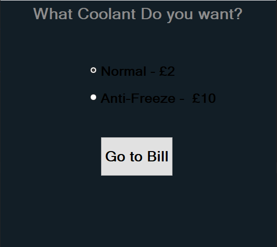
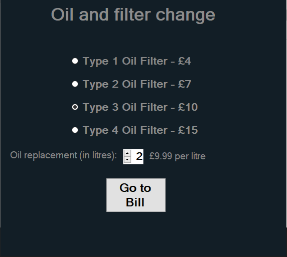
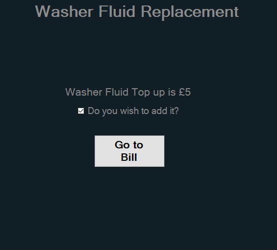
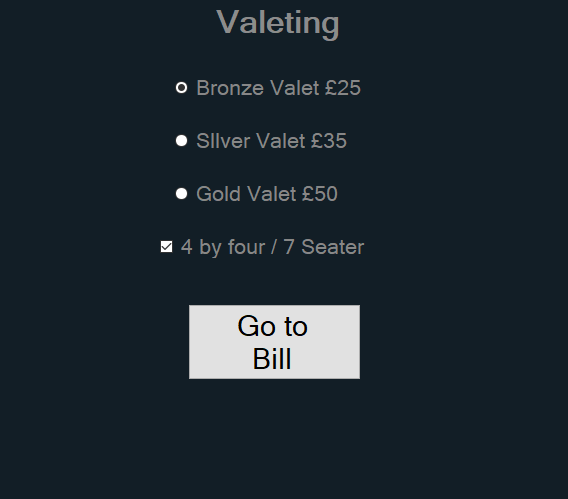
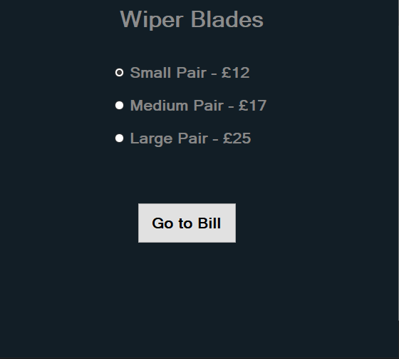

# Anna's Garage

## Forms

- **[Landing Form](#landing-form)**
- **[Job Selection Form](#job-selection-form)**
- **[MOT Form](#mot-job-form)**
- **[Coolant Topup Form](#coolant-top-up-form)**
- **[Oil Change Form](#oil-change-form)**
- **[Washer Fluid Form](#washer-fluid)**
- **[Valeting Form](#valeting)**
- **[Wiper Blades Form](#wiper-blades)**
- **[Bill Form](#bill-form)**

### Landing Form

When you see first open the application you will see a landing form and two text boxes.
In the top text box you enter the customer name and in the bottom text box you enter the job number.
Then after you enter both of them you click on the "Go to next form" button underneath.

### Job Selection Form

Next is the Job Selection form. First thing you may notice are all the radio buttons (round check boxes).
This is how you select you job. First you need to click on the button that matches the job you want. Then
you need to click the "Go to your job form" button refer back to [Forms](#forms) for all the job forms and
how to use them.

### MOT Job Form

If you selected the MOT Job Form then this is how you use it. First of all you need to select the MOT Class
You have 3 options: Class 4, Class 5, Class 7. Click the matching radio button (circular check button) to what
MOT class you want. Next you need to add the amount of headlights and tail lights. You can check the amount of lights
by clicking the up and down arrows until the numbers match the head/tail lights you need. Also, if you need halogen
headlights you need to click the checkbox next to the headlight number box.
After you've done this you then click the "Go to Bill Form" button.

### Coolant Top up Form

If you selected the Coolant Top up Form then all you need to do is select if you want Normal or Anti-freeze.
To do this you must click the radio button (circular checkbox) that matches your choice.

### Oil Change Form

For this form you need to select the type of filter you need by clicking on the radio button (circular checkbox).
Next you need to select amount of litres of oil you need by clicking the up and down arrows until the number
matches the amount you need.

### Washer Fluid

This Form is pretty simple. All you want to do is check the checkbox if you wish to add a washer fluid Top up. 

### Valeting

For this form you need to select the matching radio button (circular checkbox) for the type of valet and then check
the checkbox below the radio buttons if it's a 4x4 or 7 seater.

### Wiper Blades

This Form is fairly simple. Select the radio button (circular checkbox) that matches the size of wipers you want. 

### Bill Form

The Bill Form is the final form on the application, and it includes a total price and underneath that it has a
rundown of what you are charging for.

