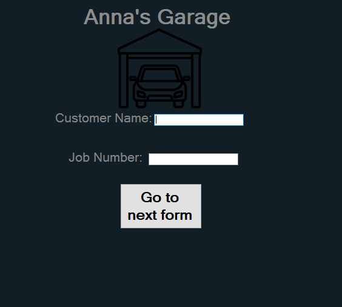
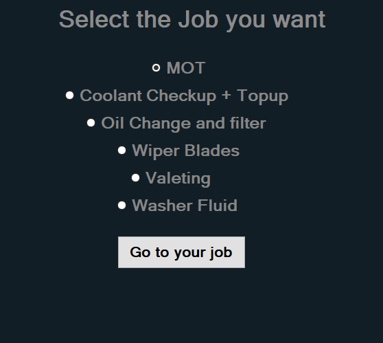
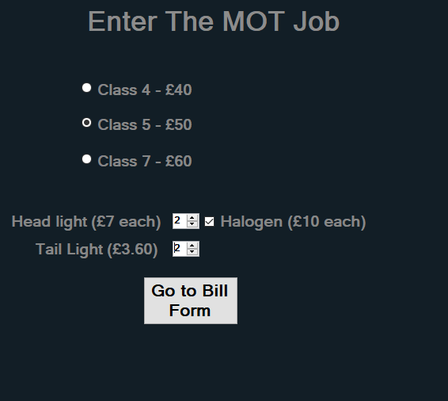
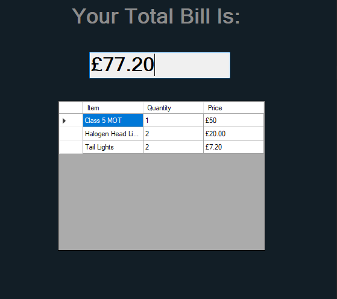

# Anna's Garage

## How To

1. First step is to enter your customer name and job number and click the button below

2. Select The job you wish to do

in this example I'll use the MOT job

3. Select the options on the job form and click the Bill for button

4. Afterward it will being you to a final bill form with a summary of what you bought and the total cost

